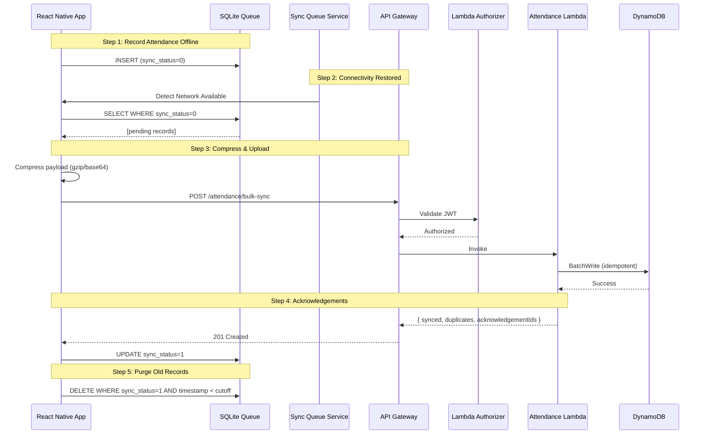

# AWS Backend Architecture

## Architecture Diagram

```mermaid
graph TB
    subgraph "Client Device (Offline-First)"
        RN[React Native App]
        SQ[Sync Queue<br/>SQLite + AsyncStorage]
        GPS[GPS Service]
        Liveness[Liveness Engine]
        FR[Face Recognition]
    end

    subgraph "AWS Cloud"
        subgraph "API Layer"
            CGW[API Gateway]
            LA[Lambda Authorizer<br/>JWT Validation]
        end

        subgraph "Business Logic"
            PA[POST /attendance<br/>Single Record]
            BS[POST /attendance/bulk-sync<br/>Batch Upload]
            RE[POST /employee/register<br/>Register]
            GE[GET /employee/{id}<br/>Query]
            SS[GET /sync-status/{userId}<br/>Status]
            HC[GET /health<br/>Health Check]
        end

        subgraph "Data Layer"
            DB[(DynamoDB<br/>NHAIAttendance)]
            S3[S3 Bucket<br/>Audit Images]
        end

        subgraph "Auth"
            CP[Cognito User Pool]
        end

        subgraph "Monitoring"
            CW[CloudWatch<br/>Logs + Metrics]
            XR[X-Ray Tracing]
        end
    end

    subgraph "Sync Flow"
        direction LR
        OFFLINE[Offline<br/>Record -> SQLite]
        CONNECT[Connectivity<br/>Detected]
        COMPRESS[Compress<br/>Payload]
        UPLOAD[Upload to<br/>API Gateway]
        ACK[Receive<br/>Acknowledgement]
        PURGE[Purge<br/>Synced Records]
    end

    RN --> SQ
    SQ -->|Periodic Sync| CGW
    GPS --> RN
    Liveness --> RN
    FR --> RN

    CGW --> LA
    LA --> CP
    CGW --> PA
    CGW --> BS
    CGW --> RE
    CGW --> GE
    CGW --> SS
    CGW --> HC

    PA --> DB
    BS --> DB
    RE --> DB
    GE --> DB
    SS --> DB
    BS -.->|Optional| S3

    PA --> CW
    BS --> CW
    PA --> XR
    BS --> XR

    OFFLINE --> CONNECT --> COMPRESS --> UPLOAD --> ACK --> PURGE
```

## Data Flow

### Offline Attendance Sync



## DynamoDB Schema

### Table: `NHAIAttendance`
- **Billing:** PAY_PER_REQUEST
- **Encryption:** AWS KMS (SSE)
- **Point-in-Time Recovery:** Enabled
- **TTL:** 365 days on `ttl` attribute

| Attribute | Type | Description |
|-----------|------|-------------|
| pk | String (HASH) | `ATTENDANCE#{id}` or `EMPLOYEE#{id}` |
| sk | String (RANGE) | `METADATA#{id}` or `PROFILE#{id}` |
| gsipk | String | `ATTENDANCE` or `EMPLOYEE` (for GSI) |
| gsisk | String | Timestamp or name (for GSI) |
| userId | String | Employee ID (for UserIdIndex GSI) |
| timestamp | Number | Epoch ms (for TimestampIndex GSI) |
| id | String | Unique record ID |
| userName | String | Display name |
| latitude | Number | GPS latitude |
| longitude | Number | GPS longitude |
| livenessPassed | Boolean | Liveness check result |
| confidence | Number | Recognition confidence |
| syncStatus | String | `synced` |
| deviceId | String | Source device |
| ttl | Number | TTL expiry (epoch seconds) |

### Global Secondary Indexes

1. **UserIdIndex** - `userId` (HASH), `timestamp` (RANGE)
   - Purpose: Query attendance by user, sorted by time
   - Projection: ALL

2. **TimestampIndex** - `gsipk` (HASH), `timestamp` (RANGE)
   - Purpose: Query all attendance by date range
   - Projection: ALL

## Lambda Functions

| Function | Handler | Runtime | Memory | Timeout |
|----------|---------|---------|--------|---------|
| TokenAuthorizer | handlers/auth.lambdaAuthorizer | nodejs20.x | 128MB | 10s |
| PostAttendance | handlers/attendance.postAttendance | nodejs20.x | 256MB | 29s |
| BulkSync | handlers/attendance.bulkSyncAttendance | nodejs20.x | 512MB | 60s |
| RegisterEmployee | handlers/employee.registerEmployee | nodejs20.x | 256MB | 29s |
| GetEmployee | handlers/employee.getEmployee | nodejs20.x | 256MB | 29s |
| UpdateEmployee | handlers/employee.updateEmployee | nodejs20.x | 256MB | 29s |
| DeleteEmployee | handlers/employee.deleteEmployee | nodejs20.x | 256MB | 29s |
| GetSyncStatus | handlers/sync-status.getSyncStatus | nodejs20.x | 256MB | 29s |
| HealthCheck | handlers/health.healthCheck | nodejs20.x | 128MB | 5s |

## API Endpoints

| Method | Path | Auth | Description |
|--------|------|------|-------------|
| POST | /attendance | JWT | Single attendance record |
| POST | /attendance/bulk-sync | JWT | Batch upload (max 500) |
| POST | /employee/register | JWT | Register employee |
| GET | /employee/{id} | JWT | Get employee details |
| PUT | /employee/{id} | JWT | Update employee |
| DELETE | /employee/{id} | JWT | Deactivate employee |
| GET | /sync-status/{userId} | JWT | Sync status for user |
| GET | /health | None | Health check |

## Security

- **JWT Authentication** via Lambda authorizer
- **Cognito** for user management (optional)
- **DynamoDB encryption at rest** (SSE)
- **S3 server-side encryption** for audit images
- **API Gateway** with request validation
- **CloudWatch** for audit logging
- **X-Ray** for distributed tracing
