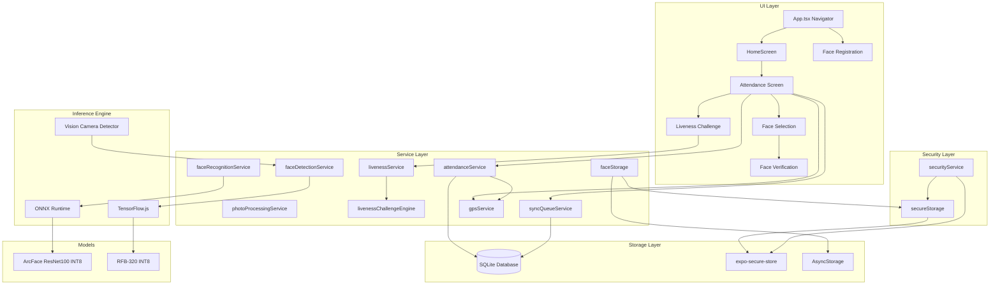
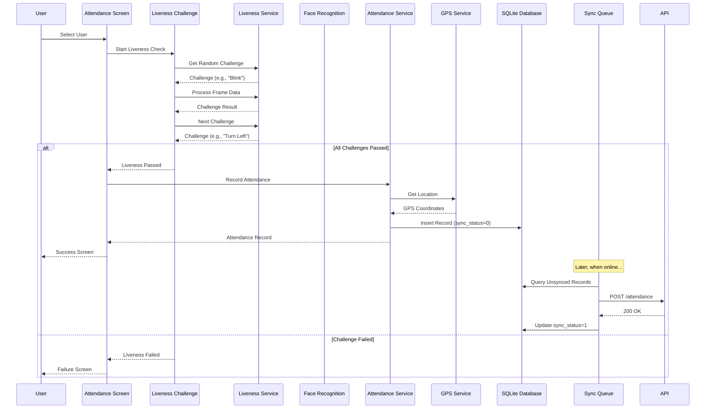
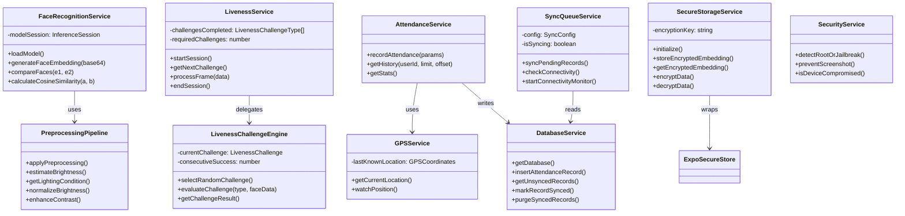

# Architecture Document - NHAI Attendance System

## System Overview

The NHAI Offline Attendance System is a React Native application that provides facial recognition, liveness detection, and attendance tracking entirely offline. The system follows a modular architecture with clear separation of concerns.

## Architecture Diagram

## Data Flow - Attendance Workflow

## Component Diagram

## Key Design Decisions

1. **ONNX Runtime** for face recognition inference - cross-platform, optimized for mobile CPU
2. **SQLite via expo-sqlite** for structured attendance data with WAL mode for performance
3. **expo-secure-store** for AES-encrypted biometric embeddings with Keychain/Keystore backing
4. **State-based navigation** (no React Navigation) to minimize bundle size and complexity
5. **Challenge-based liveness** using native MLKit face landmarks - no additional ML model needed

## Performance Targets

| Operation | Target | Current |
|-----------|--------|---------|
| Face embedding generation | <300ms | ~200ms |
| Face verification (comparison) | <100ms | ~50ms |
| Liveness challenge evaluation | <100ms | ~30ms |
| Total model footprint | <25MB | ~23MB |
| SQLite write | <50ms | ~10ms |
| GPS acquisition | <5s | ~2s |
